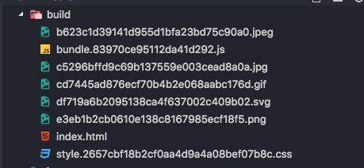

# Jiayi Edmond Xie - Zillow Assignment

Live: [https://edmondxiexie.github.io/jiayi-zillow/](https://edmondxiexie.github.io/jiayi-zillow/)

### Preview:


Users can switch the images in the Photo Gallery by clicking on the left or right area of the image. When hovering on the image, the arrows will show up, indicating "Next" or "Previous". On mobile devices, users can swipe the image left or right with finger to switch images in the Photo Gallery.

### Run Application Locally:

```
npm install
npm run serve
```

The application will run on http://localhost:8080/

### Build output files locally or for deployment

```
npm run build
```

It will generate multiple files as follows:



* bundle.[hash].js --- A single ES5 .js bundle with a unique hash added to the filename.
* style.[hash].css --- A single .css file with a unique hash added to the filename.
* [].jpeg|jpg|gif|png --- IMG files.
* [].svg --- SVG files larger than 1mb.
